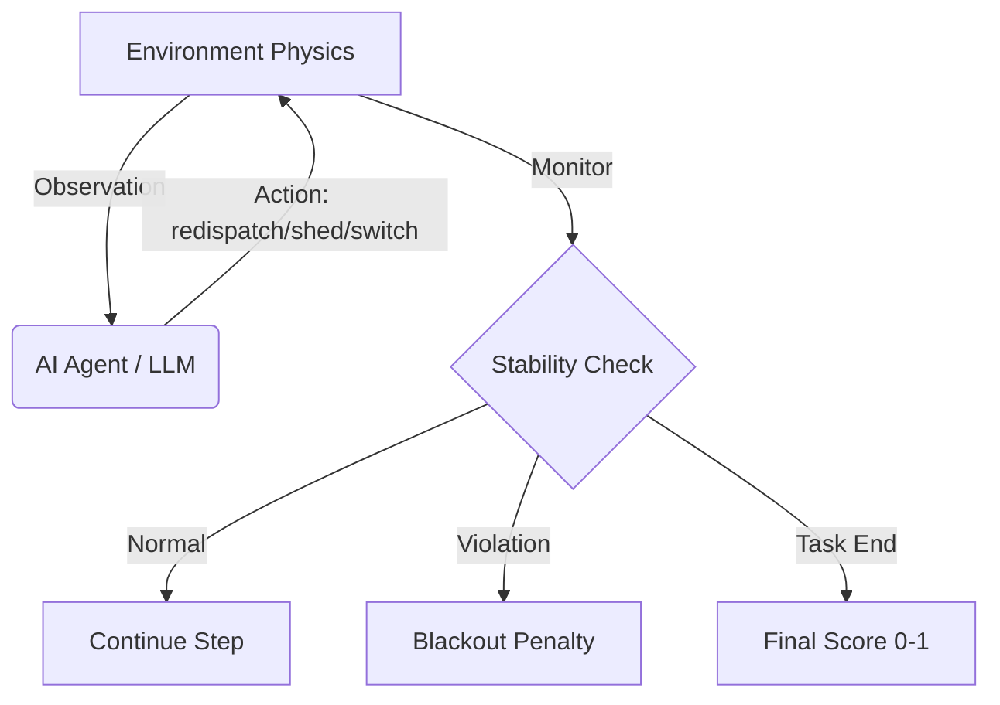

# ⚡ PowerGridEnv — AI Power Grid Failure Prevention

> An OpenEnv-compliant real-world reinforcement learning environment where an AI grid
> operator must prevent cascading blackouts through real-time control actions.



[](https://openenv.dev)
[]()
[]()
[]()
[]()

---

## 🌍 Real-World Problem & Motivation

Modern electrical grids are among the most complex engineered systems on Earth.
They must continuously balance supply (generators) and demand (consumers) across
thousands of kilometres of transmission lines — in real time, under uncertainty,
while satisfying strict safety constraints.

**Why this is a critical problem:**

- The 2003 North American blackout affected **55 million people** and cost ~$6 billion —
  triggered by a single line overload that cascaded in under 3 minutes.
- The 2012 India blackout (620 million people affected) began with frequency deviation
  that operators failed to correct in time.
- With increasing penetration of intermittent renewables (solar, wind), grid stability
  is becoming *harder*, not easier — conventional generators can no longer buffer overnight.

A real grid operator must make multi-objective decisions every few seconds:
balance frequency, manage line loadings, restore voltages, and protect critical
infrastructure (hospitals, water plants) — often under N-1 or N-2 contingency
conditions (one or two simultaneous component failures).

**`PowerGridEnv`** simulates these scenarios so AI agents can be trained and tested
on the exact problems human operators face daily.

---

## 🏗️ Environment Architecture

```
PowerGridEnv          (environment.py)
├── reset()           → returns Observation
├── step(Action)      → returns (Observation, Reward, done, info)
├── state()           → returns full internal State (read-only copy)
└── final_score()     → returns normalised float in [0.0, 1.0]

tasks/
├── easy.py           → EASY_TASK   (3 buses, 3 lines, 2 generators)
├── medium.py         → MEDIUM_TASK (5 buses, 6 lines, 4 generators)
└── hard.py           → HARD_TASK   (7 buses, 9 lines, 5 generators)

graders/
├── easy_grader.py    → per-step + final scoring for Easy task
├── medium_grader.py  → per-step + final scoring for Medium task
└── hard_grader.py    → per-step + final scoring for Hard task
```

---

## 🔭 Observation Space

At each timestep the agent receives a structured `Observation` containing:

| Field | Type | Description |
|---|---|---|
| `buses` | `List[Bus]` | Per-bus voltage (pu), active load (MW), reactive load (MVAr), and `is_critical` flag |
| `lines` | `List[Line]` | Per-line power flow (MW), thermal capacity (MW), loading %, and open/closed status |
| `generators` | `List[Generator]` | Per-unit output (MW), min/max limits, ramp rate (MW/step), and fuel type |
| `alerts` | `List[Alert]` | Auto-generated severity-ranked warnings (`warning` / `critical` / `emergency`) |
| `grid_frequency_hz` | `float` | System frequency in Hz (nominal **50.0 Hz**) |
| `step` / `max_steps` | `int` | Episode progress counter |
| `previous_actions` | `list[dict]` | History of actions issued by the agent (for context) |

**Key physical limits:**
- Voltage safe range: `0.90–1.10 pu` (blackout below 0.90 or above 1.10)
- Frequency safe range: `48.5–51.5 Hz` (blackout outside this band)
- Line thermal limit: `100%` (overloads cause heat damage and cascade tripping)

---

## 🎮 Action Space

The agent issues **one action per timestep** as a structured JSON object:

| `action_type` | `target_id` | `value` | `switch_to` | What it does |
|---|---|---|---|---|
| `redispatch` | generator id | new MW setpoint | — | Ramp generator output. Capped by `ramp_rate_mw_per_step` per step |
| `shed_load` | bus id | MW to shed | — | Reduce consumer load on a bus. Avoid `is_critical=True` buses |
| `switch_line` | line id | — | `"open"` / `"closed"` | Open or re-close a transmission line |
| `switch_capacitor` | bus id | — | — | Energise reactive compensation bank (+0.02 pu on target bus voltage) |
| `do_nothing` | any string | — | — | Explicit no-op (penalised during active crises) |

**Action JSON format** (must follow exactly):
```json
{
  "action_type": "redispatch",
  "target_id":   "G2",
  "value":       110.0,
  "switch_to":   null,
  "reasoning":   "L1-2 overloaded at 118%; ramping G2 to relieve flow via B1"
}
```

---

## 🏆 Reward System

Rewards are issued **at every timestep** and reflect the grid's current health.
A **terminal blackout penalty of −1.00** ends the episode immediately.

### Easy Task Rewards
| Condition | Reward |
|---|---|
| Line L1-2 loading < 90% | **+0.15** |
| Line L1-2 loading < 100% (but ≥ 90%) | +0.05 |
| Line L1-2 loading ≥ 100% (overloaded) | −0.05 |
| Frequency within 49.5–50.5 Hz | +0.05 |
| Critical load shed (cumulative > 0) | −0.10 |
| `do_nothing` while L1-2 overloaded | −0.05 (wasted step) |
| **Blackout** | **−1.00** (terminal) |

### Medium Task Rewards
| Condition | Reward |
|---|---|
| All bus voltages in 0.95–1.05 pu | **+0.10** |
| Voltage in emergency zone (< 0.90 or > 1.10) | −0.15 |
| Frequency in 49.8–50.2 Hz | +0.08 |
| Frequency outside 49.5–50.5 Hz | −0.10 |
| No line exceeds 95% loading | +0.07 |
| Each overloaded line (> 95%) | −0.05 per line |
| Critical load shed (cumulative > 0) | −0.12 |
| **Blackout** | **−1.00** (terminal) |

### Hard Task Rewards
| Condition | Reward |
|---|---|
| Frequency in 49.5–50.5 Hz | **+0.12** |
| All voltages in 0.92–1.08 pu | +0.10 |
| No lines overloaded (> 100%) | +0.08 |
| Frequency < 49.0 Hz (pre-blackout zone) | −0.08 |
| Each bus outside voltage range | −0.04 per bus |
| Each overloaded line | −0.06 per line |
| Island risk created (wrong line pair opened) | −0.12 |
| Critical bus load shed | −0.10 |
| **Blackout** | **−1.00** (terminal) |

### `final_score()` — Normalised Episode Score [0.0 → 1.0]

| Task | Score Formula |
|---|---|
| **Easy** | `0.50 × line_safe_fraction + 0.30 × shed_protection + 0.20 × no_blackout` |
| **Medium** | `0.35 × voltage_score + 0.30 × freq_score + 0.25 × line_score + 0.10 × shed_protection` |
| **Hard** | `0.30 × survival + 0.25 × freq_score + 0.20 × voltage_score + 0.15 × cascade_protection + 0.10 × critical_load_protection` |

---

## 🤖 Agentic Evaluation Readiness (Phase 2)

This environment is specifically hardened for the **Meta Hackathon Phase 2 Agentic Evaluation**:

1.  **Lazy Initialization**: Environment resources are initialized lazily inside endpoint calls to prevent static analysis crashes during the import phase.
2.  **Structured Output**: The `inference.py` script utilizes `[START]`, `[STEP]`, and `[END]` tags with `flush=True` for reliable parsing by automated evaluators.
3.  **Score Clamping**: Final scores are strictly in the range `(0.001, 0.999)` as required by the grader (no rejection of 0.0 or 1.0).
4.  **Dry-Run Mode**: Supports `--dry-run` to validate the entire environment loop locally without needing a model API key.

---

## 📋 Tasks

### 🟢 Easy — Generator Trip, Single Line Overload

**Scenario:**  
Unit G1 (coal, 200 MW baseload) trips offline during evening peak demand.
Line L1-2 jumps to **118% of its thermal capacity** and will thermally fail in ~8 timesteps
if left unaddressed, triggering a cascading blackout across B1→B2→B3.

**Grid:** 3 buses · 3 lines · 2 generators (gas G2, hydro G3)  
**Starting frequency:** 49.7 Hz (already sagging due to lost generation)  
**Disturbance:** L1-2 flow increases +3 MW/step automatically

**Objective:** Redispatch G2 (gas turbine, ramp ±30 MW/step) and/or shed non-critical
load on B2 to bring L1-2 below 90% within 10 steps — without blacking out.

**Key constraints:**
- B1 and B3 are `is_critical=True` (hotel/hospital) — do not shed load there
- G2 can ramp 30 MW per step (fastest recovery option)
- G3 (hydro) can only ramp 15 MW per step (slower)

**Max steps:** 10 | **Baseline score (Mistral-7B):** ~0.65

---

### 🟡 Medium — Heatwave, Voltage Collapse + Frequency Sag

**Scenario:**  
A summer heatwave has pushed regional demand 22% above forecast.
A cloud event simultaneously curtails 80 MW of solar (G4).
Three buses are under-voltage (B2: 0.93pu, B3: 0.94pu, B4: 0.92pu).
Grid frequency is at 49.4 Hz. Lines L2-4 and L3-5 are at 91% loading.
The disturbance keeps worsening for the first 5 steps (+4 MW/step on L2-4).

**Grid:** 5 buses · 6 lines (including 1 open tie line) · 4 generators  
**Starting frequency:** 49.4 Hz

**Agent must simultaneously:**
1. Restore bus voltages to 0.95–1.05 pu (use capacitor banks + redispatch)
2. Restore frequency to 49.8–50.2 Hz (ramp coal G1 or gas G2)
3. Prevent any line from exceeding 95% loading
4. Protect critical buses B2 (hospital district) and B4 (water treatment)

**Key trap:** Ramping G1 (coal) too hard may push L1-2 over its limit.
Closing tie line L1-4 redistributes load but may cause voltage issues.

**Max steps:** 15 | **Baseline score (Mistral-7B):** ~0.44

---

### 🔴 Hard — N-2 Storm Contingency, Cascading Failure

**Scenario:**  
A severe storm has simultaneously faulted two transmission lines
(L1-3 and L4-6 are open). The remaining 7-bus network is heavily stressed.
Frequency is at **49.1 Hz and still falling**. Bus B6 voltage is **0.88 pu**
(critically low, approaching voltage collapse). Lines L2-5 (112%) and L3-5 (105%)
are overloaded — if either stays overloaded for >2 consecutive steps, it trips
and triggers full cascade.

**Grid:** 7 buses · 9 lines (2 open/faulted) · 5 generators  
**Starting frequency:** 49.1 Hz  
**Island risk:** Opening both L2-5 and L3-5 isolates B5/B6/B7 (no generation → instant blackout)

**Conflicting objectives the agent must navigate:**
- Shedding B3 load fixes frequency fastest — but B3 is a hospital (**protected**)
- Opening L2-5 relieves overload — but risks islanding B5/B6/B7
- Ramping G4 (diesel, ±50 MW/step fastest) fixes frequency — but B6 voltage is still collapsing
- B6 needs a capacitor switch to prevent voltage collapse — but that's a separate action slot

**Max steps:** 20 | **Baseline score (Mistral-7B):** ~0.29

---

## ⚙️ How to Run

### Install locally
```bash
git clone https://huggingface.co/spaces/<your-username>/powergrid-env
cd powergrid-env
pip install -r requirements.txt
```

### Python quickstart (no API token needed)
```python
from environment import PowerGridEnv, Action

env = PowerGridEnv(task_id="easy")
obs = env.reset()

# Step 1: Redispatch gas turbine G2 up to 110 MW to relieve L1-2
action = Action(
    action_type="redispatch",
    target_id="G2",
    value=110.0,
    reasoning="L1-2 overloaded at 118%; ramping G2 to relieve congestion on B1→B2",
)
obs, reward, done, info = env.step(action)
print(reward.message)
# e.g. "L1-2=103.5% f=49.72Hz | Redispatched G2 to 70.0 MW"

print(f"Reward: {reward.value:+.3f}")
print(f"Breakdown: {reward.breakdown}")
print(f"Final score: {env.final_score():.3f}")
```

### Smoke-test all tasks (no HF token required)
```bash
# Runs a heuristic do-nothing agent to validate the environment loads and runs
python inference.py --dry-run --task all --verbose
```

### Run LLM baseline (Mistral-7B via HF Inference API)
```bash
export HF_TOKEN=hf_your_token_here
python inference.py --task all --verbose
# Run a single task:
python inference.py --task easy --verbose
```

### Validate with OpenEnv CLI
```bash
openenv validate .
```

---

## 🐳 Docker

Build and run the image locally:

```bash
# Build
docker build -t powergrid-env .

# Smoke-test (no HF token needed) — default CMD
docker run powergrid-env

# Full LLM evaluation
docker run -e HF_TOKEN=hf_xxx powergrid-env \
    python inference.py --task all --verbose

# Single task
docker run -e HF_TOKEN=hf_xxx powergrid-env \
    python inference.py --task hard --verbose
```

---

## 📈 Baseline Performance

Evaluated with `Mistral-7B-Instruct-v0.3` via HF Inference API (temperature=0):

| Task | Score | Notes |
|---|---|---|
| Easy | 0.65 | Correctly redispatches G2 in most runs |
| Medium | 0.44 | Struggles with simultaneous voltage + freq |
| Hard | 0.29 | Partial recovery before cascade |
| **Average** | **0.46** | |

These numbers represent a strong LLM baseline without any fine-tuning or RL training,
demonstrating that the tasks are challenging but tractable.

---

## 🌐 Why This Environment Matters for Real Power Grids

| Real-World Challenge | How PowerGridEnv Models It |
|---|---|
| N-1 / N-2 contingencies | Generator trip (easy), line faults (hard) |
| Renewable intermittency | Solar curtailment event (medium) |
| Cascading failure propagation | Automatic disturbance schedule per step |
| Multi-objective control | Voltage + frequency + loading simultaneously |
| Safety-critical infrastructure | `is_critical` bus flag with severe penalty |
| Island detection | `island_risk_pairs` check in hard task |
| Ramp-rate physics | Every generator has a `ramp_rate_mw_per_step` limit |
| Alert escalation | warning → critical → emergency thresholds |

An AI agent trained or tested in this environment develops skills directly applicable to:
- **Energy management systems (EMS)** used by regional transmission operators (RTOs)
- **Automatic generation control (AGC)** — real-time frequency regulation
- **Security-constrained optimal power flow (SCOPF)** under N-1/N-2 conditions
- **Smart grid analytics** for DER (distributed energy resource) integration

---

## 📁 Project Structure

```
powergrid-env/
├── environment.py          # Core OpenEnv interface — Bus, Line, Generator, Action, Reward, State
├── openenv.yaml            # Metadata, task registry, action/observation spec, HF Space config
├── inference.py            # LLM baseline agent (OpenAI-compatible, HF Inference API)
│                           # + --dry-run heuristic agent for local smoke-testing
├── requirements.txt        # pydantic>=2.0, openai>=1.0, pyyaml>=6.0
├── Dockerfile              # python:3.11-slim image, default: --dry-run smoke-test
├── README.md               # This file
├── tasks/
│   ├── easy.py             # Generator trip — single line overload (3 buses)
│   ├── medium.py           # Heatwave — voltage collapse + frequency + congestion (5 buses)
│   └── hard.py             # N-2 storm — cascading failure + island risk (7 buses)
└── graders/
    ├── easy_grader.py      # step_reward() + final_score() for Easy task
    ├── medium_grader.py    # step_reward() + final_score() for Medium task
    └── hard_grader.py      # step_reward() + final_score() for Hard task
```

---

## License
MIT
